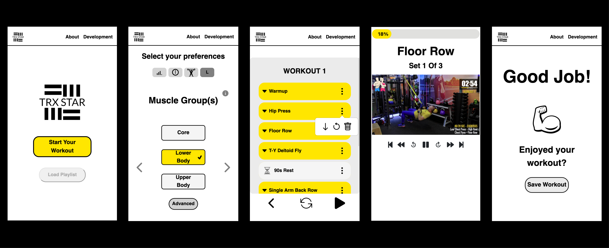
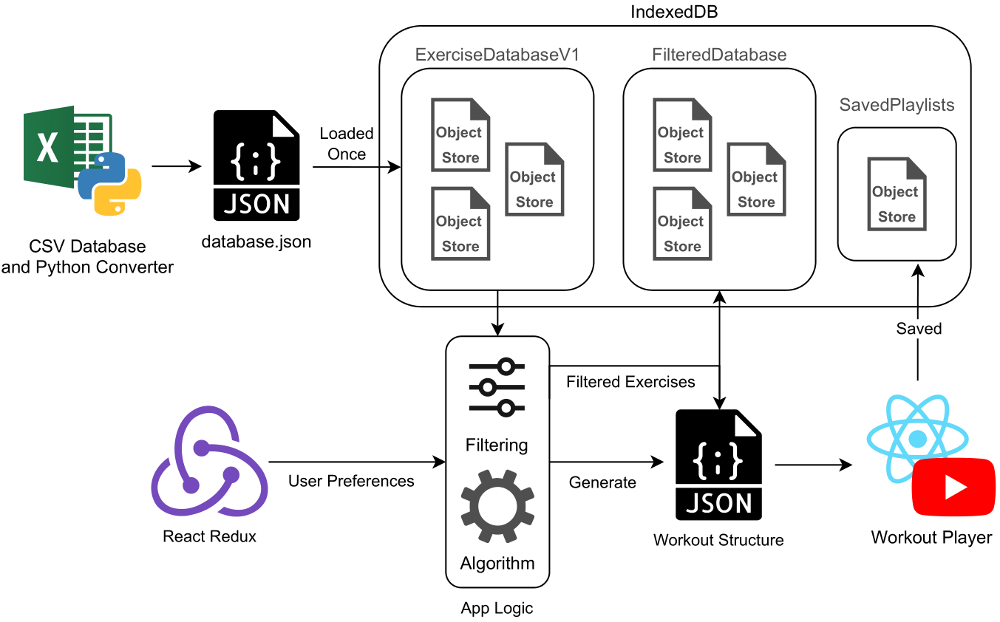
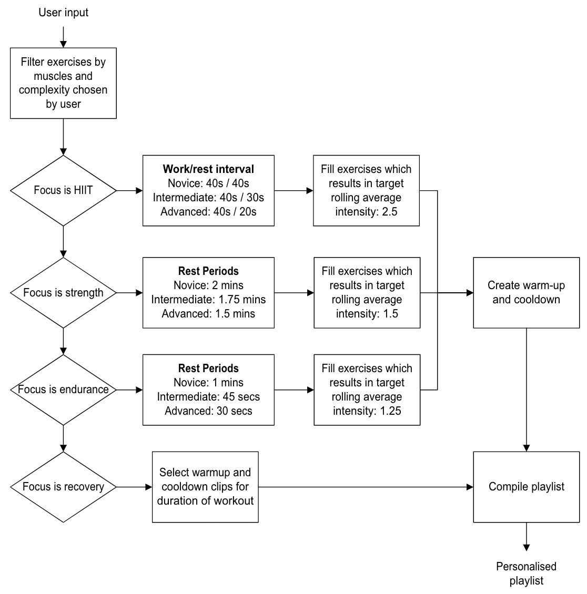

*This is a read only clone of the project repo.*

# TRX Exercise App
This is a React-based progressive web application designed to help users personalise their TRX workouts. In building this app we had two overarching goals:
1.  Democratize workout platforms and empower users to take
control of their exercise experience. Currently, users can watch free videos and follow
along with a coach, however, this is not personalised and can get repetitive. The other
option is to buy personalised workout plans, which are not guided by a coach, and are
limited to a few workouts. TRX STAR bridges this gap by allowing users to select their
preferences and generate a new playlist of exercises guided by a coach. Our vision
for TRX STAR is for it to also become a platform where coaches can easily create and
share their content with a vast audience of users.
2. Build a lightweight and highly-scalable app so that it can be used by a wide audience without
incurring the costs of a large, centralised database. To implement this we used the in-browser database [IndexedDB](https://developer.mozilla.org/en-US/docs/Web/API/IndexedDB_API/Using_IndexedDB).



## Installation
To install the dependencies, run:

```bash
npm install
```
## Usage
To start the app, run:

```bash
npm start
```
Then, open http://localhost:3000 to view it in the browser.

## Deployment
This app can be deployed to any hosting service that supports Node.js applications.

To build the app for production, run:

```bash
npm run build
```
This will create an optimized production build of the app in the build folder.

## Tech Stack



### Technologies Used
- React
- IndexedDB
- Redux Toolkit
- React Router
- React Bootstrap
- Sass
- YouTube API

## Algorithm
The algorithm takes the user preferences as input. A filtered
exercise database is generated according to the muscles and complexity chosen. The
structure is informed by trusted practices in the fitness community and varies accord-
ing to focus and complexity. This is populated using clips from the filtered database. A
rolling average calculation is used to control the overall intensity of the workout and
of consecutive clips according to the target intensities shown in Figure 3. To avoid
user burnout, the algorithm is non-deterministic and generates unique workouts



## License
This project is licensed under the MIT License - see the LICENSE file for details.

## Credits
Authors: Eugene Ting, Adela Viskova, Daniel Doyle, Philippe Paquin-Hirtle, Soren Antebi and Sofia Hernandez Gelado.

TRX videos: [PrivateGYMFitness](https://www.youtube.com/@PrivateGYMFitness).

With special thanks to our project coordinators: Shubham Jain and Yves-Alexandre de Montjoye.

## Demo
You can check out a live demo of this app at https://trxstar.co.uk.

## Roadmap
We're excited to share some potential changes and improvements we're considering for future releases of the project, but we also welcome and encourage contributions from our community, so feel free to share your ideas and help us shape the direction of this project:

- Utilise service worker to create a comprehensive offline experience up until YouTube pages
- Pre-load YouTube videos during rest section

We're always looking for new contributors to help us bring these exciting changes to life, so if you're interested in getting involved, please check out our Contributing guidelines below and submit a pull request!

## Contributing
We welcome contributions from anyone interested in improving this project. If you'd like to contribute, please follow these steps:

1. Fork the repository.
2. Create a new branch for your changes.
3. Make your changes and commit them with descriptive commit messages.
4. Push your changes to your fork.
5. Submit a pull request to the main repository.

We will review your changes as soon as possible and may provide feedback or request additional changes before merging your pull request. By contributing to this project, you agree to abide by our code of conduct (insert link to your code of conduct document).

## Folder Structure
```
/trx-exercise-app
├── README.md
├── database_scripts
|  ├── csv
|  ├── csv_to_json.py
|  ├── json
|  └── main.py
├── node_modules
├── package-lock.json
├── package.json
├── public
|  ├── images
|  ├── index.html
|  ├── logo.png
|  ├── manifest.json
|  ├── offline.html
|  ├── robots.txt
|  └── serviceworker.js
└── src
   ├── App.js
   ├── assets
   ├── components
   ├── data
   ├── index.css
   ├── index.js
   ├── redux
   ├── sassStyles
   └── scripts
```

## Acknowledgments
-  This project was bootstrapped with [Create React App](https://create-react-app.dev/).
